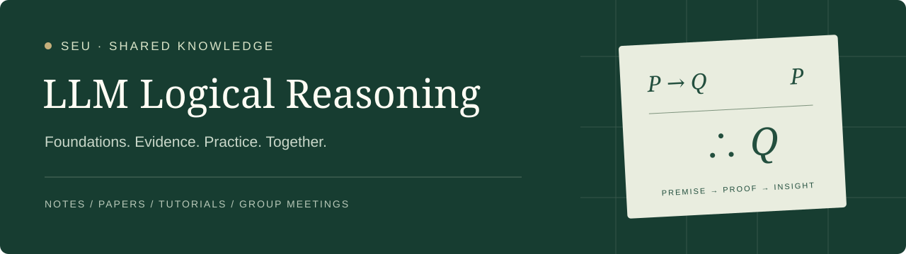

<p align="center">
  
</p>

<p align="center">
  
</p>

<h1 align="center">SEU 大模型逻辑推理知识库</h1>

<p align="center">东南大学大模型逻辑推理学习小组共建 · 逻辑基础 · 论文阅读 · 实践教程 · 组会记录</p>

<p align="center">
  <a href="https://yishuaigeng.github.io/seu-llm-logical-reasoning/">阅读网站</a> ·
  <a href="docs/getting-started/README.md">开始学习</a> ·
  <a href="CONTRIBUTING.md">参与共建</a> ·
  <a href="https://github.com/YishuaiGeng/seu-llm-logical-reasoning/discussions">讨论交流</a>
</p>

<p align="center">
  <a href="https://github.com/YishuaiGeng/seu-llm-logical-reasoning/actions/workflows/pages.yml"></a>
  <a href="LICENSE"></a>
  <a href="LICENSE-DOCS"></a>
</p>

## 关于这个项目

本知识库由东南大学大模型逻辑推理学习小组成员共同维护，聚焦**大模型的逻辑推理能力**：模型能否依据前提可靠地推导结论？什么训练与推理机制有帮助？怎样用可检验的证据评估这些能力？

我们将主题笔记、论文阅读、可运行教程与组会讨论连接起来，让个人理解成为可追溯、可修订的共同积累。

## 从一个问题开始

**答案正确，推理就有效吗？**

- 阅读 [蕴涵、有效性与反例](docs/notes/logic-foundations/implication-and-entailment.md)，区分命题真值、推理有效性与论证健全性。
- 跟随 [真值表教程](docs/tutorials/truth-table.md)，用 Python 找到一个无效推理的反例。
- 继续 [Z3 教程](docs/tutorials/z3-validity.md)，把有效性检查交给求解器，并扩展到一阶逻辑。
- 参考 [论文阅读方法](docs/getting-started/reading-guide.md)，把结论、证据与个人假设分开记录。

## 知识导航

| 栏目 | 内容 | 入口 |
| --- | --- | --- |
| 开始学习 | 学习路线、研究范围与阅读方法 | [入门指南](docs/getting-started/README.md) |
| 主题笔记 | 逻辑基础、推理方法、训练与评测 | [浏览笔记](docs/notes/README.md) |
| 论文阅读 | 问题、方法、证据、局限与复现记录 | [论文索引](docs/papers/README.md) |
| 实践教程 | 有环境说明与验证结果的动手教程 | [教程索引](docs/tutorials/README.md) |
| 组会记录 | 汇报材料、讨论分歧与后续行动 | [会议索引](docs/meetings/README.md) |
| 资源导航 | 逻辑教材、论文检索、形式化工具与术语表 | [资源索引](docs/resources/README.md) |

## 如何参与

1. 选择一个小问题，例如一篇[候选论文](docs/papers/README.md#candidates)，复制[对应模板](templates/README.md)。
2. 在自己的分支**新建一个文件**，填写开头的 frontmatter，标注来源和待验证之处。导航、索引、学习路线与首页统计会自动更新。
3. 提交 Pull Request，CI 检查元信息、构建网站并运行示例，另一位成员审阅后合并。
4. 合并后网站自动更新；页面底部可以直接评论，长期问题通过 Issues 跟踪。

可以直接使用 GitHub 网页编辑。论文推荐和开放讨论放在 Discussions，错误报告与明确任务放在 Issues。完整要求见[贡献指南](CONTRIBUTING.md)与[行为准则](CODE_OF_CONDUCT.md)。

## 本地预览

需要 Python 3.10+。以下命令在仓库根目录运行：

```bash
python -m venv .venv
source .venv/bin/activate
python -m pip install -r requirements.txt
mkdocs serve
```

Windows 激活命令为 `.venv\Scripts\activate`。浏览器打开终端给出的本地地址。已经安装 `uv` 时，也可以使用：

```bash
uv run --python 3.12 --with-requirements requirements.txt mkdocs serve
```

构建与检查：

```bash
python scripts/check_content.py      # 检查 frontmatter
mkdocs build --strict                # 严格构建
python scripts/check_site.py         # 检查站内链接与锚点
python -m pip install -r examples/z3-validity/requirements.txt
python scripts/run_examples.py       # 运行全部示例自检
```

部署方式、文件分工和维护约定见[维护指南](PROJECT_PLAN.md)。文档网站使用 [MkDocs Material](https://squidfunk.github.io/mkdocs-material/)，通过 GitHub Actions 发布到 GitHub Pages。

## 开放内容与许可

- **原创文档、笔记与项目自绘图形**：采用 [CC BY 4.0](LICENSE-DOCS)，允许分享与改编，须署名、链接许可证并标注修改。
- **代码、脚本与网站模板**：采用 [MIT License](LICENSE)。
- **东南大学校徽**（`docs/assets/brand/seu-*.png`）版权归东南大学所有，仅用于标识成员所属学校，不适用上述任何开放许可，复用本项目时请删除或另行取得授权。
- 第三方材料遵循其原有许可；不默认纳入本项目授权。使用校徽不表示学校对本项目内容的背书。

引用具体笔记时，请保留作者、标题、来源链接及可识别的版本。完整范围与署名示例见[许可说明](docs/community/license.md)。内部讨论与未发表资料应保存在独立私有空间，不提交到公开知识库。
